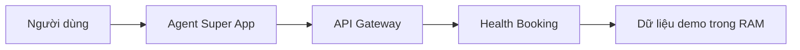

# Health Booking — Hướng dẫn Mini-app đăng ký lịch khám

## 1. Tổng quan

**Health Booking** là mini-app demo cho phép người dùng:

- Xem danh sách bác sĩ và chuyên khoa.
- Xem các ca khám còn chỗ.
- Đặt một lịch khám.
- Kiểm tra thông tin lịch đã đặt.
- Đổi sang ca khám khác của cùng bác sĩ.
- Hủy lịch và hoàn lại chỗ cho ca khám.

Mini-app được xây dựng bằng **FastAPI**. Backend API và giao diện web cùng nằm
trong một file `main.py`, vì vậy chỉ cần chạy một tiến trình Uvicorn.

Phiên bản demo dùng dữ liệu **in-memory**: bác sĩ, ca khám và lịch đặt được giữ
trong bộ nhớ của ứng dụng. Không bắt buộc Supabase hoặc PostgreSQL.

> Lưu ý: Health Booking chỉ mô phỏng thao tác đặt lịch, không đưa ra chẩn đoán
> hoặc tư vấn y tế.

---

## 2. Vai trò trong Super App

Health Booking là một dịch vụ độc lập. Super App không import trực tiếp code của
mini-app mà gọi các endpoint thông qua HTTP.



Luồng ví dụ:

1. Người dùng hỏi: “Ngày mai có bác sĩ nội khoa nào còn lịch không?”
2. Agent gọi `GET /doctors` để tìm bác sĩ.
3. Agent gọi `GET /slots` để lấy ca còn chỗ.
4. Người dùng chọn bác sĩ và giờ khám.
5. Super App yêu cầu người dùng xác nhận.
6. Agent gọi `POST /bookings` để tạo lịch.
7. Health Booking trả về mã lịch và thông tin ca khám.

Các thao tác tạo, đổi và hủy lịch đều là hành động thay đổi dữ liệu, vì vậy phải
có bước **Human-in-the-Loop (HITL)** — người dùng xác nhận trước khi Super App gọi
endpoint.

---

## 3. Phạm vi demo

### 3.1. Bác sĩ mẫu

| Mã bác sĩ | Bác sĩ | Chuyên khoa | Phòng | Phí khám |
|---|---|---|---|---:|
| `DOC-NOI-01` | BS. Nguyễn Minh Anh | Nội tổng quát | P.201 | 250.000 VNĐ |
| `DOC-NHI-01` | BS. Trần Thu Hà | Nhi khoa | P.202 | 280.000 VNĐ |
| `DOC-MAT-01` | BS. Lê Quốc Bảo | Mắt | P.203 | 300.000 VNĐ |
| `DOC-TMH-01` | BS. Phạm Ngọc Lan | Tai Mũi Họng | P.204 | 280.000 VNĐ |

### 3.2. Quy tắc ca khám

- Tạo ca cho 7 ngày tiếp theo.
- Không tạo ca vào Chủ nhật.
- Mỗi ca kéo dài 30 phút.
- Ca sáng: `08:00`, `08:30`, `09:00`, `09:30`.
- Ca chiều: `14:00`, `14:30`, `15:00`.
- Mỗi ca có tối đa 2 lượt đặt.
- Đặt lịch thành công làm số chỗ còn lại giảm 1.
- Hủy lịch làm số chỗ còn lại tăng 1.
- Không cho đặt khi ca đã hết chỗ.
- Chỉ cho đổi sang ca khác thuộc cùng bác sĩ.

### 3.3. Trạng thái lịch khám

| Trạng thái | Ý nghĩa |
|---|---|
| `CONFIRMED` | Lịch đã được tạo thành công |
| `CANCELLED` | Người dùng đã hủy lịch |

---

## 4. Cấu trúc project

```text
HealthBooking/
├── main.py
├── requirements.txt
├── .env
├── .env.example
└── README.md
```

Trong bản demo tối giản:

- `main.py`: chứa API, dữ liệu mẫu, logic đặt lịch và giao diện HTML.
- `requirements.txt`: dependency Python.
- `.env`: biến môi trường local, không đẩy lên GitHub.
- `.env.example`: tên biến mẫu, không chứa secret thật.
- `README.md`: hướng dẫn chạy nhanh.

---

## 5. Biến môi trường

Tạo file `.env`:

```env
SERVICE_CODE=HEALTH_BOOKING
PUBLIC_BASE_URL=http://localhost:8502

# Không bắt buộc trong demo. Nếu có, phải trùng với key đăng ký tại Super App.
OUTBOUND_API_KEY=
```

Ý nghĩa:

| Biến | Bắt buộc | Mô tả |
|---|---|---|
| `SERVICE_CODE` | Có | Mã duy nhất của mini-app trong Super App |
| `PUBLIC_BASE_URL` | Có | URL public dùng để mở giao diện hoặc tạo deep-link |
| `OUTBOUND_API_KEY` | Không | Khóa xác thực request từ Super App sang mini-app |

Nếu `OUTBOUND_API_KEY` để trống, ứng dụng không kiểm tra header `x-api-key`. Cách
này tiện cho demo local nhưng production nên cấu hình key.

---

## 6. Chạy local trên Windows bằng Git Bash

Di chuyển vào project:

```bash
cd /d/CODE/AITHUCCHIEN/miniapp/HealthBooking
```

Tạo môi trường ảo:

```bash
python -m venv .venv
```

Cài dependency:

```bash
./.venv/Scripts/python.exe -m pip install -r requirements.txt
```

Chạy ứng dụng:

```bash
./.venv/Scripts/python.exe -m uvicorn main:app --host 127.0.0.1 --port 8502 --reload
```

Các địa chỉ:

| Nội dung | URL |
|---|---|
| Giao diện Health Booking | <http://127.0.0.1:8502/> |
| Swagger UI | <http://127.0.0.1:8502/docs> |
| OpenAPI JSON | <http://127.0.0.1:8502/openapi.json> |
| Health check | <http://127.0.0.1:8502/health> |

`requirements.txt`:

```txt
fastapi>=0.111,<1.0
uvicorn[standard]>=0.30,<1.0
```

---

## 7. Danh sách API

| Method | Endpoint | Chức năng | HITL |
|---|---|---|---|
| `GET` | `/health` | Kiểm tra mini-app | Không |
| `GET` | `/doctors` | Xem/tìm bác sĩ | Không |
| `GET` | `/slots` | Tìm ca khám | Không |
| `POST` | `/bookings` | Đặt lịch khám | Có |
| `GET` | `/bookings/{booking_id}` | Xem lịch đã đặt | Không |
| `POST` | `/bookings/{booking_id}/cancel` | Hủy lịch khám | Có |
| `POST` | `/bookings/{booking_id}/reschedule` | Đổi ca khám | Có |

### 7.1. Kiểm tra dịch vụ

```http
GET /health
```

Response mẫu:

```json
{
  "status": "success",
  "message": "Clinic Booking đang hoạt động",
  "data": {
    "service_code": "HEALTH_BOOKING",
    "storage": "memory",
    "status": "ok"
  }
}
```

### 7.2. Tìm bác sĩ

Lấy tất cả bác sĩ:

```http
GET /doctors
```

Lọc theo chuyên khoa:

```http
GET /doctors?specialty=Nội
```

### 7.3. Tìm ca khám

```http
GET /slots?doctor_id=DOC-NOI-01&available_only=true
```

Lọc theo ngày:

```http
GET /slots?doctor_id=DOC-NOI-01&appointment_date=2026-08-27&available_only=true
```

Mỗi ca trả về các trường chính:

```json
{
  "slot_id": "DOC-NOI-01-20260827-0800",
  "doctor_id": "DOC-NOI-01",
  "date": "2026-08-27",
  "start_time": "08:00",
  "end_time": "08:30",
  "capacity": 2,
  "booked": 0,
  "remaining": 2,
  "available": true
}
```

### 7.4. Đặt lịch khám

```http
POST /bookings
Content-Type: application/json
Idempotency-Key: health-booking-001
```

Body:

```json
{
  "doctor_id": "DOC-NOI-01",
  "slot_id": "DOC-NOI-01-20260827-0800",
  "patient_name": "Nguyễn Văn A",
  "patient_phone": "0912345678",
  "reason": "Khám sức khỏe tổng quát"
}
```

Response thành công:

```json
{
  "status": "success",
  "message": "Đặt lịch khám thành công",
  "data": {
    "booking": {
      "booking_id": "CLB-A1B2C3D4",
      "doctor_id": "DOC-NOI-01",
      "doctor_name": "BS. Nguyễn Minh Anh",
      "specialty": "Nội tổng quát",
      "date": "2026-08-27",
      "start_time": "08:00",
      "end_time": "08:30",
      "patient_name": "Nguyễn Văn A",
      "status": "CONFIRMED"
    }
  }
}
```

### 7.5. Xem lịch đã đặt

```http
GET /bookings/CLB-A1B2C3D4
```

### 7.6. Hủy lịch

```http
POST /bookings/CLB-A1B2C3D4/cancel
Content-Type: application/json
Idempotency-Key: cancel-health-booking-001
```

Body:

```json
{
  "reason": "Không thể đến khám đúng giờ"
}
```

Sau khi hủy:

- `status` của booking chuyển thành `CANCELLED`.
- Ca khám được hoàn lại 1 chỗ.
- Gửi lại cùng `Idempotency-Key` không hủy hoặc cộng slot lần thứ hai.

### 7.7. Đổi ca khám

```http
POST /bookings/CLB-A1B2C3D4/reschedule
Content-Type: application/json
Idempotency-Key: reschedule-health-booking-001
```

Body:

```json
{
  "new_slot_id": "DOC-NOI-01-20260827-0830"
}
```

Quy tắc:

- Booking phải tồn tại và chưa bị hủy.
- Ca mới phải còn chỗ.
- Ca mới phải thuộc cùng bác sĩ.
- Ca cũ được hoàn lại 1 chỗ.
- Ca mới bị trừ 1 chỗ.

---

## 8. Chuẩn response

Thành công:

```json
{
  "status": "success",
  "message": "Mô tả kết quả",
  "data": {}
}
```

Lỗi nghiệp vụ:

```json
{
  "status": "error",
  "message": "Mô tả lỗi dễ hiểu",
  "code": "SLOT_FULL",
  "data": {}
}
```

Một số mã lỗi:

| Code | Ý nghĩa |
|---|---|
| `INVALID_API_KEY` | Sai `x-api-key` |
| `IDEMPOTENCY_KEY_REQUIRED` | Thiếu khóa chống lặp |
| `DOCTOR_NOT_FOUND` | Không tìm thấy bác sĩ |
| `INVALID_SLOT` | Ca không hợp lệ hoặc không thuộc bác sĩ |
| `SLOT_FULL` | Ca đã hết chỗ |
| `BOOKING_NOT_FOUND` | Không tìm thấy lịch khám |
| `BOOKING_CANCELLED` | Lịch đã hủy nên không thể đổi |
| `INVALID_NEW_SLOT` | Ca mới không thuộc cùng bác sĩ |

---

## 9. Idempotency-Key

`Idempotency-Key` là khóa giúp một request thay đổi dữ liệu không bị thực thi hai
lần khi mạng chậm hoặc Super App gửi lại request.

Health Booking yêu cầu header này với:

- `POST /bookings`
- `POST /bookings/{booking_id}/cancel`
- `POST /bookings/{booking_id}/reschedule`

Ví dụ:

```http
Idempotency-Key: thread-123-task-456
```

Nếu cùng một key được gửi lại, mini-app trả kết quả cũ thay vì tạo thêm một lịch
khám mới.

---

## 10. Đăng ký mini-app vào Super App

Thông tin cơ bản:

| Trường | Giá trị đề xuất |
|---|---|
| `service_code` | `HEALTH_BOOKING` |
| `name` | `Health Booking` |
| `description` | `Đặt, đổi và hủy lịch khám với bác sĩ theo ca còn trống` |
| `category` | `HEALTHCARE` |
| `base_url` | `http://localhost:8502` khi local |
| `health_check_url` | `http://localhost:8502/health` |
| `version_number` | `1.0.0` |
| `required_scopes` | `[]` hoặc `['end_user']` tùy hệ thống |
| `outbound_api_key` | Để trống khi demo hoặc đặt một secret dùng chung |

Khi deploy, thay URL local bằng URL Render:

```text
base_url: https://health-booking.onrender.com
health_check_url: https://health-booking.onrender.com/health
```

OpenAPI spec lấy trực tiếp tại:

```text
http://localhost:8502/openapi.json
```

hoặc production:

```text
https://health-booking.onrender.com/openapi.json
```

### Metadata dành cho Agent

Các endpoint mutation khai báo:

```json
{
  "x-risk-level": "high",
  "x-side-effect-type": "mutation",
  "x-requires-hitl": true,
  "x-idempotency-required": true,
  "x-retry-policy": "no_retry"
}
```

Các endpoint đọc dữ liệu khai báo:

```json
{
  "x-risk-level": "low",
  "x-side-effect-type": "read"
}
```

---

## 11. Deploy lên Render

Chọn:

```text
New → Web Service
```

Cấu hình:

```text
Language: Python 3
Build Command: pip install -r requirements.txt
Start Command: uvicorn main:app --host 0.0.0.0 --port $PORT
Health Check Path: /health
```

Environment Variables:

```env
SERVICE_CODE=HEALTH_BOOKING
PUBLIC_BASE_URL=https://health-booking.onrender.com
OUTBOUND_API_KEY=
```

Không tự đặt `PORT=8502` trên Render. Render cung cấp biến `$PORT` và Uvicorn phải
lắng nghe trên `0.0.0.0`.

---

## 12. Kịch bản demo end-to-end

### Kịch bản 1 — Đặt lịch

1. Người dùng: “Tôi muốn khám nội tổng quát vào sáng mai.”
2. Agent gọi `GET /doctors?specialty=Nội`.
3. Agent gọi `GET /slots?doctor_id=DOC-NOI-01&available_only=true`.
4. Agent đưa ra các ca còn chỗ.
5. Người dùng chọn `08:00`.
6. Super App hiển thị thông tin và yêu cầu xác nhận.
7. Agent gọi `POST /bookings`.
8. Mini-app trả mã booking và trạng thái `CONFIRMED`.

### Kịch bản 2 — Đổi ca

1. Người dùng: “Đổi lịch của tôi sang 8 giờ 30.”
2. Agent tìm ca mới còn chỗ.
3. Super App yêu cầu xác nhận đổi lịch.
4. Agent gọi `POST /bookings/{booking_id}/reschedule`.
5. Health Booking hoàn chỗ ca cũ và giữ chỗ ca mới.

### Kịch bản 3 — Hủy lịch

1. Người dùng: “Hủy lịch khám vừa đặt.”
2. Super App hiển thị lịch cần hủy và yêu cầu xác nhận.
3. Agent gọi `POST /bookings/{booking_id}/cancel`.
4. Health Booking chuyển lịch sang `CANCELLED` và hoàn slot.

---

## 13. Test nhanh bằng curl

Danh sách bác sĩ:

```bash
curl "http://127.0.0.1:8502/doctors"
```

Ca còn trống:

```bash
curl "http://127.0.0.1:8502/slots?doctor_id=DOC-NOI-01&available_only=true"
```

Đặt lịch:

```bash
curl -X POST "http://127.0.0.1:8502/bookings" \
  -H "Content-Type: application/json" \
  -H "Idempotency-Key: demo-health-001" \
  -d '{
    "doctor_id": "DOC-NOI-01",
    "slot_id": "DOC-NOI-01-YYYYMMDD-0800",
    "patient_name": "Nguyen Van A",
    "patient_phone": "0912345678",
    "reason": "Kham suc khoe tong quat"
  }'
```

Thay `YYYYMMDD` bằng ngày thật lấy từ response của `GET /slots`.

---

## 14. Giới hạn của bản demo

- Dữ liệu mất khi ứng dụng restart hoặc redeploy.
- Không có đăng nhập riêng; mini-app nhận thông tin người dùng từ Super App.
- Chưa có thanh toán.
- Chưa có email/SMS nhắc lịch.
- Chưa kiểm tra xung đột lịch giữa nhiều instance của Render.
- Chưa có hồ sơ bệnh án và không lưu thông tin y tế dài hạn.
- Dữ liệu bác sĩ và ca khám là dữ liệu mẫu.

Đối với MVP, các giới hạn này chấp nhận được vì mục tiêu là chứng minh luồng:

```text
Tìm bác sĩ → tìm ca → xác nhận → đặt lịch → đổi hoặc hủy lịch
```

Khi nâng cấp production, nên chuyển booking và slot sang PostgreSQL/Supabase, áp
dụng transaction để chống đặt vượt số chỗ, xác thực request chặt chẽ và bổ sung
audit log.

---

## 15. Checklist hoàn thành

- [ ] `SERVICE_CODE=HEALTH_BOOKING`.
- [ ] Chạy được `GET /health`.
- [ ] Giao diện mở được tại `/`.
- [ ] Swagger mở được tại `/docs`.
- [ ] Có ít nhất 4 bác sĩ mẫu.
- [ ] Mỗi ca có số chỗ cố định.
- [ ] Đặt lịch làm giảm số chỗ.
- [ ] Hủy lịch hoàn lại số chỗ.
- [ ] Đổi lịch cập nhật đúng ca cũ và ca mới.
- [ ] Endpoint mutation yêu cầu `Idempotency-Key`.
- [ ] Endpoint mutation có `x-requires-hitl: true`.
- [ ] OpenAPI spec đăng ký được vào Super App.
- [ ] URL production không còn `localhost`.

